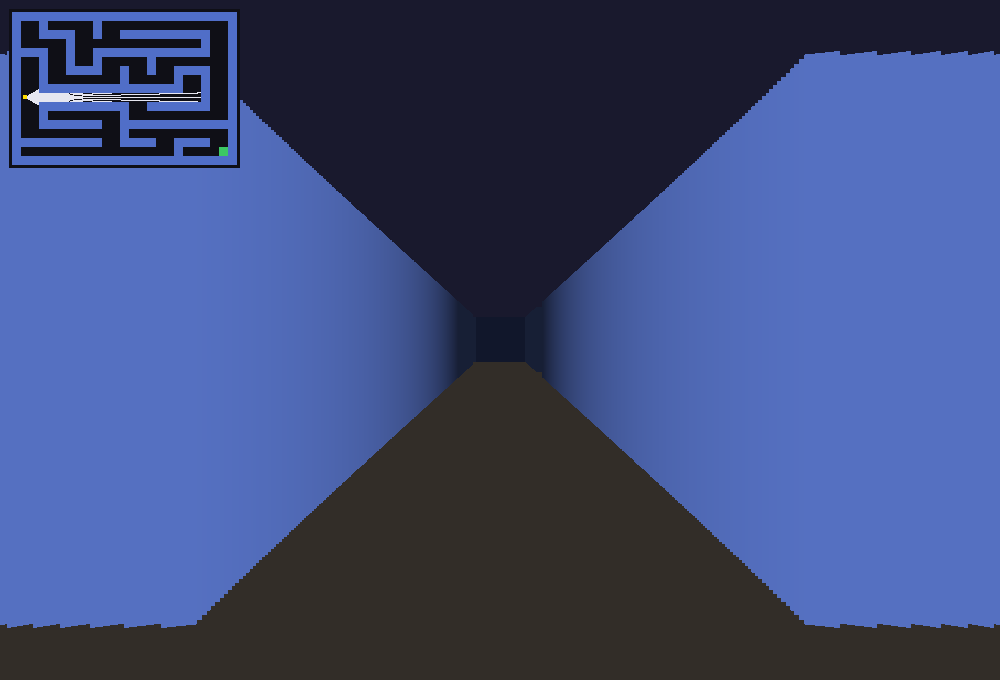
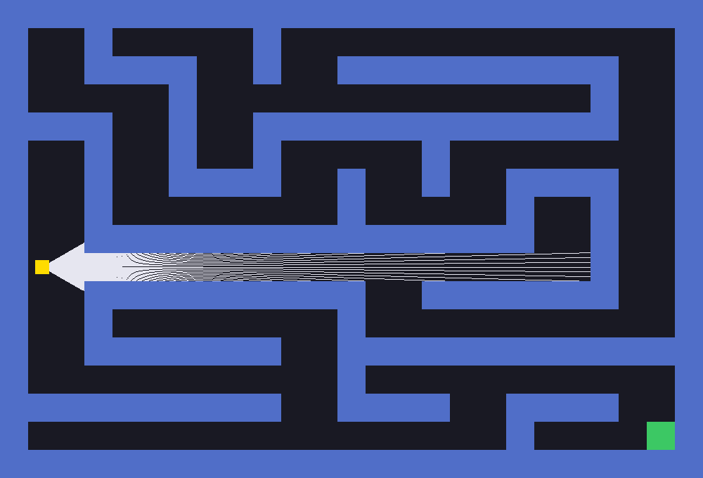

# Laberinto 3D con raycasting

Laberinto en primera persona hecho en Rust con [raylib](https://www.raylib.com/), usando la
misma técnica de raycasting del Wolfenstein 3D: el mundo es un mapa 2D de caracteres y la
"tercera dimensión" se arma lanzando un rayo por cada columna de pantalla y convirtiendo la
distancia a la pared en la altura de esa columna.

Todo se dibuja pixel por pixel sobre un framebuffer propio; raylib solo se usa para abrir la
ventana, leer el teclado y subir el framebuffer a la pantalla como textura.





## Cómo correrlo

```bash
cargo run           # modo debug, corre a 60 fps sin problema
cargo run --release # si quieren más margen
```

El programa lee `maze.txt` del directorio desde donde se ejecuta, así que hay que correrlo
desde la raíz del proyecto.

## Controles

| Tecla | Acción |
|---|---|
| `W` / `S` | Avanzar y retroceder en la dirección de vista |
| `A` / `D` | Girar la cámara |
| `M` | Cambiar entre vista 3D y mapa 2D completo |
| `N` | Mostrar u ocultar el minimapa |
| `F1` | Guardar una captura en `maze.png` |
| `ESC` | Salir |

El juego arranca en la vista 3D con el minimapa en la esquina.

## El archivo del laberinto

`maze.txt` es texto plano donde cada caracter es una celda:

| Caracter | Significado |
|---|---|
| `+` `-` `\|` | Pared |
| espacio | Piso |
| `p` | Posición inicial del jugador |
| `g` | Meta |

```
+--+--+--+--+
|p          |
+  +--+  +  +
|  |     |  |
+  +  +--+--+
|  |        |
+  +--+--+  +
|        | g|
+--+--+--+--+
```

Se puede cambiar por cualquier otro mapa: la ventana se dimensiona sola según el tamaño del
archivo (`ancho_en_caracteres * BLOCK_SIZE`). Si el mapa se hace muy grande, hay que bajar
`BLOCK_SIZE` en `main.rs` para que quepa en pantalla. Las filas no necesitan medir todas lo
mismo — los espacios finales que borran los editores se tratan como piso.

## Estructura

```
src/
  main.rs         Ventana, loop principal y los dos modos de render
  maze.rs         Tipo Maze: carga el archivo y responde qué hay en cada celda
  player.rs       Struct Player (posición, ángulo, fov) y el manejo del teclado
  caster.rs       cast_ray: lanza un rayo y devuelve dónde y contra qué pegó
  framebuffer.rs  Buffer de pixeles, se sube a la ventana como textura cada frame
```

## Cómo funciona

**El rayo.** `cast_ray` avanza de pixel en pixel desde el jugador en la dirección `a`:

```rust
let x = player.pos.x + d * a.cos();
let y = player.pos.y + d * a.sin();
```

En cada paso convierte esa posición a celda (`x / BLOCK_SIZE`) y se detiene al topar con
pared, devolviendo un `Intersect` con la distancia recorrida y el caracter que golpeó. El
parámetro `draw_line` decide si va pintando el camino: se usa en el mapa 2D, no en la
proyección 3D.

**El abanico.** Los rayos se reparten dentro del campo de visión (`fov = π/3`), empezando en
`a - fov/2` y avanzando una fracción del fov por rayo. El mapa 2D dibuja 120, el minimapa 40
y la vista 3D lanza uno por cada columna de la pantalla.

**La proyección.** Cada distancia se vuelve una columna vertical de pared centrada en la
mitad de la pantalla:

```rust
let d = intersect.distance * (a - player.a).cos();
let stake_height = (BLOCK_SIZE as f32 / d) * distance_to_plane;
```

Dos detalles ahí:

- El `cos(a - player.a)` corrige el ojo de pez. Los rayos de las orillas del fov recorren más
  distancia que los del centro, y sin esa corrección las paredes rectas se ven abombadas.
- `distance_to_plane = (ancho/2) / tan(fov/2)` en vez de una constante calibrada a mano, así
  que cambiar el fov no obliga a reajustar la escala de las paredes.

Las paredes lejanas se oscurecen para dar profundidad y las verticales van un tono más
oscuras que las horizontales, que es lo que deja ver las esquinas.

**El minimapa.** Es el mismo mapa 2D encogido. Los rayos se lanzan en coordenadas del mundo
(con `draw_line = false`) y la línea se dibuja aparte multiplicando cada punto por la escala
y sumando el offset de la esquina; si se dibujaran directo saldrían regados por toda la
pantalla en vez de dentro del recuadro.

**Rendimiento.** Como todo se redibuja cada frame, pintar pixel por pixel con una llamada a
raylib por pixel costaba 26 ms por frame en la vista 3D (unos 38 fps). `Framebuffer::fill_rect`
usa `ImageDrawRectangle` para pintar cada columna en tres llamadas — cielo, pared y piso — en
vez de una por pixel, y eso bajó el frame a ~6 ms en debug.

## Tests

```bash
cargo test
```

Hay una prueba que lanza rayos en un laberinto mínimo y verifica las distancias, para no
romper la trigonometría al tocar `cast_ray`. Corre sin abrir ventana.

## Pendiente

- Detectar cuándo el jugador llega a la `g` y mostrar la pantalla de victoria.
- Texturas en las paredes en lugar de color plano.
